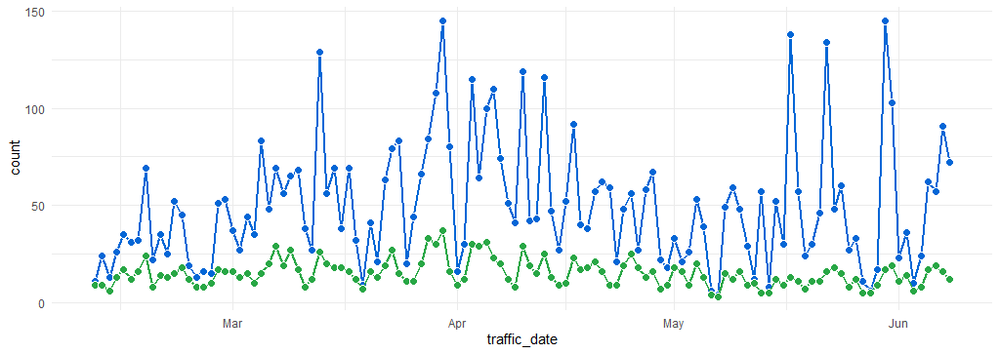

# Traffic Tracker

This repository demonstrates a practical example of how Python and GitHub Actions can automate the downloading and storage of web traffic data for GitHub repositories. Monitoring and analyzing user traffic is vital for tracking the impact of federal agencies. While .gov sites can utilize tools like Google Analytics for website views, tracking views on external sites, such as code hosted on GitHub, relies on GitHub's traffic insights. However, GitHub repositories only provide user traffic data for the past two weeks, limiting long-term analysis.

To overcome this challenge, we use Python to interact with the GitHub API and programmatically capture traffic statistics. This process is automated on a daily or weekly basis using GitHub actions. By adopting this approach, we can capture and store web traffic for GitHub repositories beyond the default time frame, enabling a comprehensive understanding of the long-term impact of our repositories. 

The code in this repository demonstrates this process for regularly store traffic data for the [HHS-AHRQ repositories](https://github.com/HHS-AHRQ).

## Process

### Step 1: Generate Personal Access Token

To access the GitHub API, you need a personal access token. Follow these steps to generate one:

1. Navigate to [**"GitHub Developer Settings"**](https://github.com/settings/developers).
2. Select **"Personal access tokens (classic)".**
3. Click **"Generate new token (classic)".**
4. Add a note (e.g., 'python_meps').
5. Set an expiration date (GitHub will email you when it's almost expired).
6. Check the **"repo"** box.
7. Click **"Generate token"**.

> **PRO TIP**: If this code is in a public repo, don't paste the token in your Python code! Save it as a 'secret' in the GitHub repo (under 'Settings' > 'Secrets and variables' > 'Actions'), then refer to it using the `os.getenv` function.


### Step 2: Write Python Code to Query the API and Output Data to CSV

The Python script `github_api_traffic.py` loops through all repositories under the user 'HHS_AHRQ'. You can use it as an example to query the API for a single repository. Note that the token you generate must come from an account with push access to the repository.

Here's an example of Python code that queries traffic data for the 'MEPS' repository:

```python
# Your Python code here
from datetime import date
import pandas as pd
import os
import requests

token = os.getenv("GH_TOKEN")  # get secret token

# Set headers, using token
headers = {
    "Authorization": f"token {token}",
    "User-Agent": "testing-requests-5801",
    "Accept": "application/vnd.github.v3+json",
}

ahrq_repos_url = "https://api.github.com/users/HHS-AHRQ/repos"

user = "HHS-AHRQ"
repo_name = "MEPS"

traffic_views = f"https://api.github.com/repos/{user}/{repo_name}/traffic/views"

# Make request and output to CSV
r = requests.get(traffic_views, headers=headers)

# Select traffic 'views' from the response
traffic_df = pd.DataFrame(r.json()['views'])

traffic_df.to_csv(f"traffic_reports/{repo_name}/traffic_{repo_name}_{date.today()}.csv", index=False)
```

### Step 3: Run Code Automatically Using GitHub Actions

To run the Python code automatically using GitHub Actions, first create a new repository (like this one, called 'traffic-tracker') and commit the Python code to the repository. Create a new workflow by selection **Actions > New Workflow > set up a workflow yourself**. A new YAML file will be created in the `.github/workflows` directory. 

In this repository, the YAML file `.github/workflows/run_tracker.yml` contains the GitHub Actions workflow that runs the Python code every day. It also tells GitHub to commit the CSV files to the repository. The `requirements.txt` file tells GitHub actions which Python libraries to load prior to running the Python code. Here's an example:

```yaml
name: Traffic Tracker
on:
  # Run every day at 6am UTC time (2am EST)
  schedule:
    - cron: "0 6 * * *"

jobs:
  build:
    runs-on: ubuntu-latest

    steps:
      - name: Checkout repository
        uses: actions/checkout@v2

      - name: Set up Python
        uses: actions/setup-python@v2
        with:
          python-version: '3.11'

      - name: Install dependencies
        run: pip install -r requirements.txt

      - name: Run Python script
        env:
          GH_TOKEN: ${{ secrets.GH_TOKEN }}
        run: python github_api_traffic.py

      - name: Commit changes
        run: |
          git config --global user.email "[EMAIL@DOMAIN.com]"
          git config --global user.name "[NAME]"
          git add .
          git commit -m "Add generated CSV traffic files"
          git push
```


Make sure to set the Workflow Permissions to "Read and Write". to do this: 
1. Go to **"Settings"** in the repository
2. Select **"Actions > General"**
3. Scroll down to **"Workflow permissions"** and select **"Read and write permissions"**
4. Click **"Save"**


### Step 4: Visualize the Traffic Data

In order to gain insights from the captured web traffic data beyond the default time frame provided by GitHub, we can visualize the data using R. The R code `github_traffic_plots.R` in this repository combines the CSV files, de-duplicates the entries, and creates line graphs using the ggplot library.

These line graphs provide a comprehensive view of the traffic patterns for a selected repository, to view the long-term impact of the repositories. The visualizations resemble the GitHub traffic graphs but cover extended periods.

By visualizing the traffic data, we can identify trends, fluctuations, and patterns in user engagement over time. This can be valuable for assessing the effectiveness of our repositories, tracking the impact of our projects, and making data-driven decisions to optimize our online presence.

The generated line graph for the MEPS repository, for example, provides a visual representation of its traffic history:




